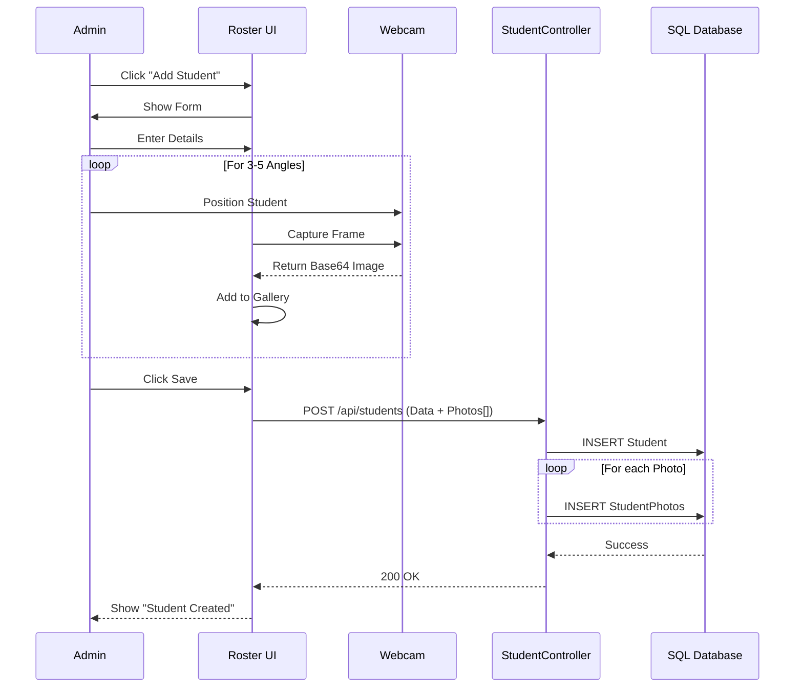
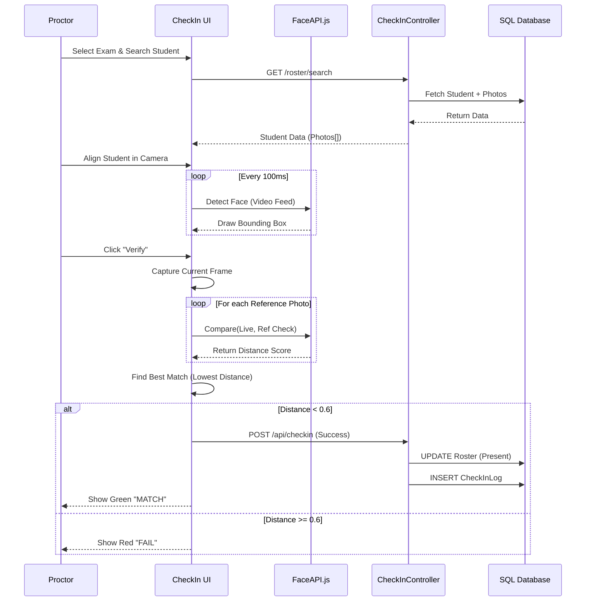
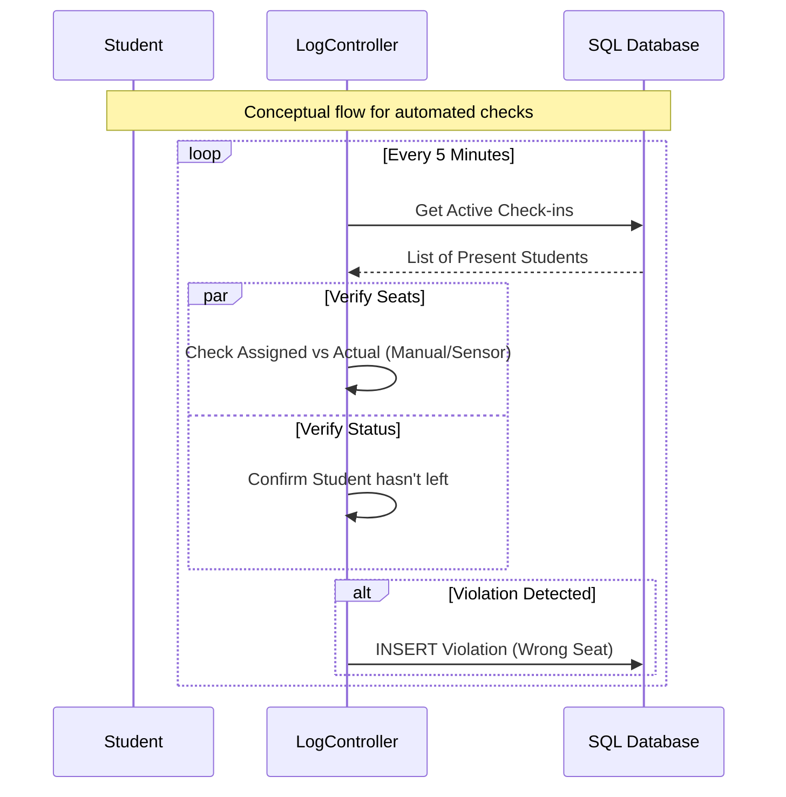
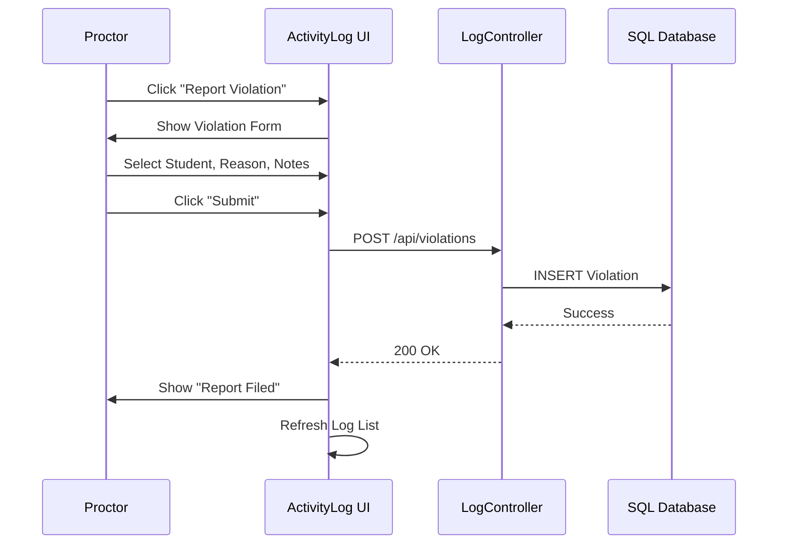
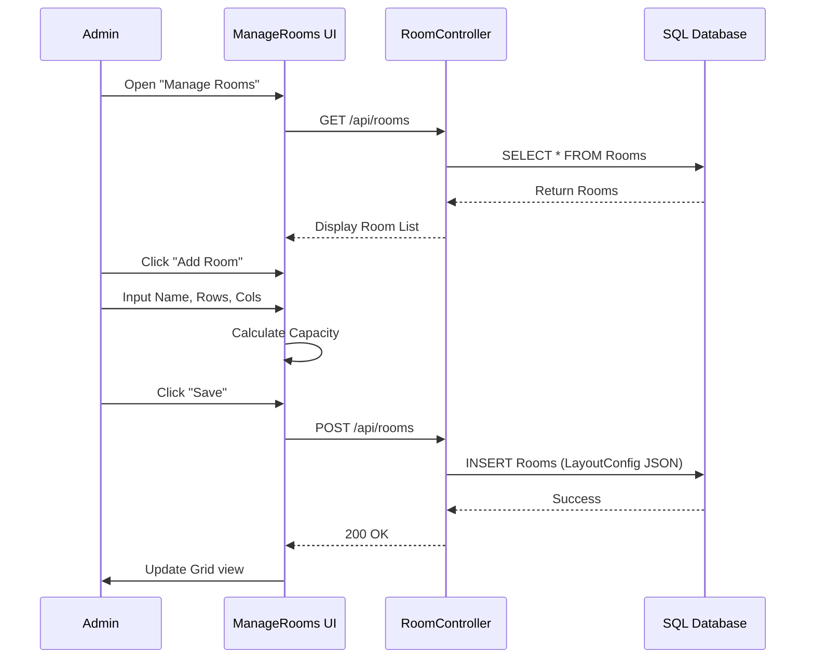

# Extended Sequence Diagrams

## SQ-01: Multi-Photo Student Registration

## SQ-02: AI-Powered Check-in Verification

## SQ-03: Real-time Seat Compliance Check

## SQ-04: Violation Logging Workflow

## SQ-05: Room Creation Flow

