# Extended Use Case Diagrams (Compatibility Mode)

> **Note**: Uses `graph LR` syntax for maximum compatibility with older Mermaid renderers.

## UC-01: Manage Student Roster

```mermaid
graph LR
    Admin[👤 Admin]
    subgraph "Roster Management System"
        UC1((Add New Student))
        UC2((Capture Reference Photos))
        UC3((Edit Student Details))
        UC4((View Roster List))
    end
    Admin --> UC1
    Admin --> UC3
    Admin --> UC4
    UC1 -.->|include| UC2
```

## UC-02: Configure Room Layouts

```mermaid
graph LR
    Admin[👤 Admin]
    subgraph "Facility Management"
        UC5((Create New Room))
        UC6((Define Seating Grid))
        UC7((View Room Capacity))
    end
    Admin --> UC5
    Admin --> UC7
    UC5 -.->|include| UC6
```

## UC-03: Exam Scheduling

```mermaid
graph LR
    Admin[👤 Admin]
    subgraph "Exam Controller"
        UC8((Create Exam Event))
        UC9((Assign Room to Exam))
        UC10((Assign Students to Exam))
    end
    Admin --> UC8
    UC8 -.->|include| UC9
    UC8 -.->|include| UC10
```

## UC-04: Proctor Check-in Session

```mermaid
graph LR
    Proctor[👤 Proctor]
    subgraph "Check-in Station"
        UC11((Select Active Exam))
        UC12((Search Student))
        UC13((Verify Identity ML))
        UC14((Override Verification))
    end
    Proctor --> UC11
    Proctor --> UC12
    Proctor --> UC13
    UC14 -.->|extend| UC13
```

## UC-05: Incident Reporting

```mermaid
graph LR
    Proctor[👤 Proctor]
    Admin[👤 Admin]
    subgraph "Security Logs"
        UC15((Log Violation))
        UC16((Attach Evidence))
        UC17((View Activity Logs))
    end
    Proctor --> UC15
    UC15 -.->|include| UC16
    Proctor --> UC17
    Admin --> UC17
```

